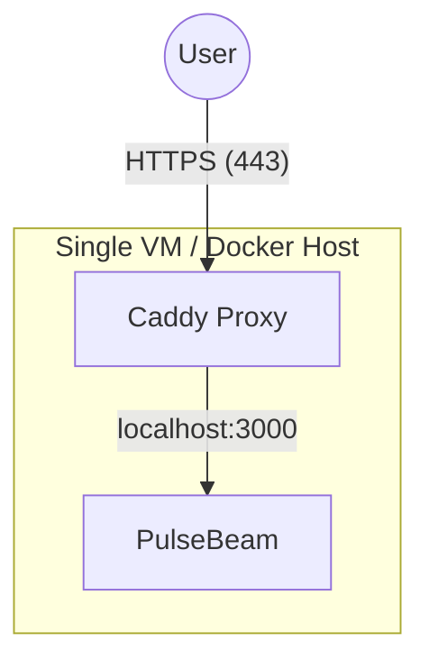
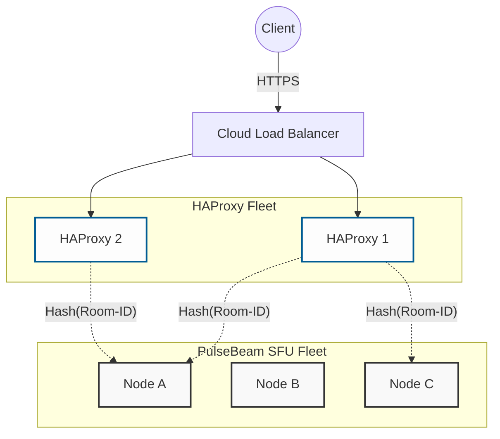

**WIP**

## Deployment Architectures

### 1. Single Node (Quick Start)

Best for testing, demos, or low-traffic internal tools. Caddy handles SSL
termination and proxies signaling traffic to PulseBeam.



```yaml
version: "3.8"
services:
  pulsebeam:
    image: ghcr.io/pulsebeamdev/pulsebeam:pulsebeam-v0.3.0
    restart: unless-stopped
    network_mode: "host"

  caddy:
    image: caddy:2
    restart: unless-stopped
    network_mode: "host"
    volumes:
      - caddy_data:/data
    command:
      - caddy
      - reverse-proxy
      - --from
      - demo.pulsebeam.dev
      - --to
      - localhost:3000

volumes:
  caddy_data:
```

### 2. Multi-Node (Production/High Availability)

For production environments requiring high availability, we recommend replacing
Caddy with HAProxy. The reverse proxy must be configured with consistent hashing
to ensure each participant connects to the correct node.

In the future, we will remove this limitation by allowing a single room to be
handled by multiple nodes.



## Port & Firewall Requirements

| Port     | Protocol | Traffic | Scope    | Purpose                           |
| -------- | -------- | ------- | -------- | --------------------------------- |
| **443**  | **UDP**  | Inbound | Public   | ICE over UDP                      |
| **443**  | **TCP**  | Inbound | Public   | ICE over TCP fallback             |
| **3000** | **TCP**  | Inbound | Internal | Proxied HTTP signaling            |
| **6060** | **TCP**  | Inbound | Private  | Metrics, health checks, and pprof |

> **Note on Networking:** `network_mode: "host"` is required to eliminate the
> overhead of Container’s network virtualization. For high-throughput real-time
> traffic, removing NAT indirection is critical for performance and ensures the
> SFU can correctly discover its public IP for ICE candidate gathering.
